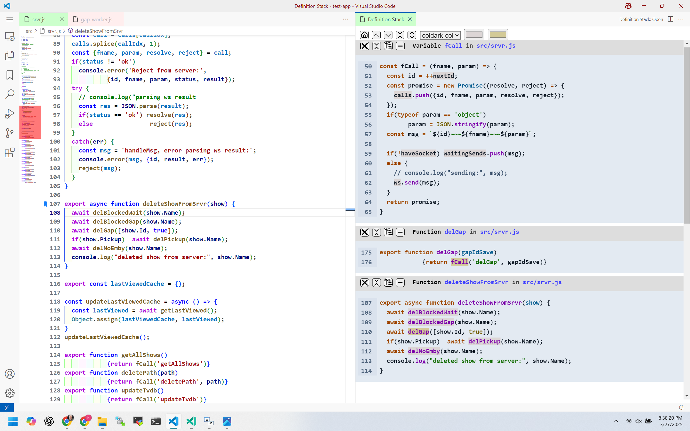

##  
**Definition Stack by eridien**

### Overview

Definition Stack is a unique vscode extension. It is a tool for reading Javascript and Typescript code, especially unfamiliar code. The source code of definitions and references are shown in a stack for fast review. Functions appear in isolation in blocks.

This is a screenshot with a source file on the left and the stack on the right.

A single command **Definition Stack:Open** is available. You place a cursor in a function in a source file and execute this command. A stack appears in a side column with a block containing a copy of the selected function.  In that block all symbols that have a definition available are highlighted. A single click on a highlighted symbol brings up the definition code for that symbol in a new block above. You can continue this to create a stack of references and definitions.

### Why this is useful

Imagine you are looking at a function and you don't know what it does. You start the stack with that function and follow the defs upward. You can delete an upper block and then click on the next symbol in the ref block below.  This allows traversing the tree of defs and refs and quickly see everything that is executed, not just what happens locally in the single function.

You can follow the code logic without thinking about source files. Not having to remember the files reduces the cognitive load. Bringing up the stack only needs to be done when you need it and it works fast. One could think of this as the Go To Definition command on steroids.

### Features

- One simple and fast command. Everything after that happens with single clicks.

- You can click on a button in a def block and all refs to that def appear in blocks below. The stack grows up and down.

- Blocks are usually functions but they can also be other symbol types like Variables and even Modules. There are 26 types total.

- There are 44 light and dark themes to choose from.

- Themes, ref highlight color settings, and text size are set directly from the header of the stack allowing you to see the results of the setting changes in real time.

- The code is positioned to the left for minimum width and makes sense for isolated code. Indentation is otherwise maintained.

- Blocks can be collapsed to a single line with a button click.  There are other buttons for deleting blocks and traversing the stack allowing control of stack contents.

- Clicking in the code pulls up the source file in the other column scrolled to that code. It can be any file in the workspace. The source path is shown in the top of each block and line numbers in the block match those in the files.

### Usage Instructions

#### There is a single header at the top of the stack.

From left to right ...

- The home button scrolls the stack to the original block, usually at the bottom.

- Up and down arrows scroll to the previous and next blocks. Of course you can also scroll anywhere with the scroll wheel or scroll bar.

- The next two buttons collapse or expand all blocks.

- The select box lets you choose a theme from 44 choices.

- The left color picker picks the color for the background 
highlighting of ref symbols.

- The right picker is the highlight color of the last symbol clicked. You can use this for easy traversal of the tree.

- The letters scale everything up and down.

####  Each block has a banner at the top.

From left to right ...

- The X deletes the block.

- Next is a button to collapse or expand the block hiding the code in the block and only showing this banner. So this image shows exactly what a collapsed block looks like.

- The third button with the up arrow finds all refs to this definition block. It creates a block for each ref showing the surrounding function.  All ref blocks are created at once.

- The large dash deletes all blocks except for this one. It is a "Close Others" operation. A common usage is to click the Home button and then this one to recreate the original stack.

- The word "Function" is the type of this def. It can be one of 26 types.

- Next is the name of the symbol which is the ref word in the code. If you click on this the stack scrolls to the ref that created this def.

- Finally there is the relative path to the file this code came from. Combining this with the line numbers give the location of the code anywhere in the workspace. Clicking on this path brings up that file but doesn't scroll it.  This is the same as using the file picker in vscode.

#### This is a complete block, including the banner described above.

- Note the language highlighting. This is Material Dark.

- The line numbers match those in the source file.

- The pink backgrounds highlight the refs that have defs. 

- Some refs are not highlighted.  Ones with the def in the same block are not.  If they were, the code would be virtually covered.  Also there are some not shown because they match ignore patterns in settings.  Ignoring node_modules is recommended.

- The yellow highlights the last ref clicked.  Please don't judge my highlight color choices.  You can easily change them. 

### More Settings

#### These are available in the vscode settings tab.

- **Entire File Ok:** Option to hide or show definitions that occupy an entire file.  If you work with large files the stack can grow excessively tall. The default is to show them.

- **Ignore File Patterns:** Defs in a file whose path  matches a pattern are ignored.  Patterns can be regexes. "node_modules" and ".d.ts" are the default patterns.

### Future

- Only Javascript and Typescript files are supported because they are the only ones with a vscode ref/def language provider. Hopefully support will be expanded to other languages. (Note: Vue is treated as javascript and single page files work well).

- There is no way to match the themes to vscode ones.  This extension uses the Prism library which works quite differently than the vscode language providers.

- Currently this is not keyboard-jockey friendly. The mouse is used for everything.  There is no reason that keyboard shortcuts couldn't be implemented but nothing has been done in this area yet.

- When a source file is edited the blocks in the stack are not updated. Tracking changes would not be easy and not work well just like bookmarks and breakpoints. This is not a serious problem since the stack is created and used quickly unlike bookmarks and breakpoints which are expected to be persistent.

- The UI is ugly.  I am not a graphics designer. Help here would be appreciated.

#### Author: Mark Hahn @ Eridien

#### Repo: https://github.com/eridien/vscode-definition-stack

#### Original Release: April 2025

#### License: MIT

Icons are provided by https://www.iconfinder.com.